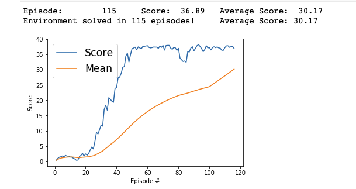

## DRL - DDPG Algorithm - Reacher Continuous Control

### Model Architecture
DDPG was used in order to solve this project along with a few modifications to
allow for 20 agent environment.

The use of two deep neural nets was the foundation behind the (Actor-Critic)
algorithm used to solve this project.

- Actor
  - 3 fully-connected Linear layers - 128 neurons in the 2 FC layers
  - reLu activation was used on the 2 hidden FC layers
  - tanH activation on final output linear layer

- Critic
  - 3 fully-connected Linear layers - 128 neurons in the 2 FC layers
  - reLu activation was used on the 2 hidden FC layers
  - linear activation fxn for final output layer

### DDPG Explained

#### Network Blueprint
DDPG uses the actor critic algorithm but is essentially composed of 4 networks:
Q network, a deterministic policy network, a target Q network, and a target
policy network. The actor in DDPG directly maps states to actons. The target
networks are just time-delayed replicas of their respective original networks
which track the learned networks. The main use of the target network is to
decouple the network from the network currently being trained on. It has been
shown that using the same values generated by a network to optimize itself tends
to diverge. In order to avoid this, the use of target networks are used.

DDPG also makes use of a replay buffer (like a lot of other RL algos). This
buffer is used to sample experiences in chunks in order to update the the value
of policy of the neural networks.

DDPG handles learning in a similar fashion to Q-learning, namely the updated Q
value is obtained using the Bellman equation. The difference being the next
state Q values are calculated using the target value network and target policy
network. Then to calculate the loss we take the mean of the sum of the
gradients. Which is then optimized using the optimizer (Adam)

Then using a soft update the target network params are copied over. This allows
for only a small portion of the target network params to be introduced to the
local networks.

Lastly DDPG includes the idea of exploration by virtue of the Ornstein-Uhlenbeck
Process or generated noise which is added to the action output.

### Hyperparameters
- learning rate: 1e-3 (actor/critic DNN)
- batch size: 128
- buffer size: 1e5
- gamma: 0.99
- tau: 1e-3
- weight decay: 0
- mu: 0.0 (Ornstein-Uhlenbeck noise)
- theta: 0.15 (Ornstein-Uhlenbeck noise)
- sigma: 0.2 (Ornstein-Uhlenbeck noise)
- num episodes: 10000
- max t: 1000

## Plot of Rewards

### Future Advancements
- Add prioritized replay buffer
- A3C algorithm
- D4PG algorithm